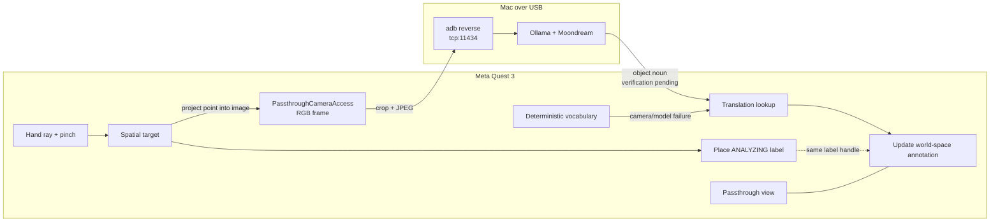

# SpatialDebugger

**Point. Pinch. Learn — turn the room around you into a mixed-reality vocabulary lesson.**

SpatialDebugger is a Meta Quest 3 prototype that places English, French, and
Spanish labels at selected points in a real room. The interaction is intentionally
small: point with a tracked hand, pinch, and leave a readable annotation fixed
at that place in the room.

Built at Hack the North 2026.

## Current status

| Status | Capability |
|---|---|
| **Verified on Quest 3** | Passthrough, stereo XR, 6DoF tracking, visible hands, pinch input, world-fixed annotations, multiple simultaneous labels, accented French/Spanish text, real non-black 1280×960 Quest RGB frames, and USB `adb reverse` networking |
| **Verified on Quest 3** | End-to-end recognition: pinch-centred crop → JPEG → Ollama/Moondream → normalization → `ANALYZING…` replaced in place; ~1.5–2.4 s warm. The pulled crop is correctly oriented and matches where the user pointed |
| **Verified on Quest 3** | The six frozen demo classes. `laptop`, `table`, `chair` and `wall` come from the vision model; `floor` and `ceiling` are settled geometrically from the depth normal and the height above the floor |
| **Verified on Quest 3** | Environment-depth placement. A pinch resolves to a measured point on the real surface: 0.68, 0.70, 0.98, 1.06, 1.87 and 2.99 m observed in one session, most with `normalConfidence = 1.00` |
| **Verified fallback** | A deterministic offline vocabulary cycle: CHAIR, LAPTOP, BOTTLE, and BACKPACK, with French and Spanish translations |

Recognition is frozen to six classes for the demo. Anything else is reported as
`NOT RECOGNIZED` rather than rounded to the nearest one — a couch stays a couch
and is not relabelled a chair.

The constraint is applied to the model's reply, not asked for in the prompt.
moondream is a 2024 VQA model with no instruction tuning: measured against a
running Ollama at temperature 0, every constrained phrasing ("choose exactly one
of…", "respond with only that word") returns an empty string or the literal
token `urn`, on every image. Only the plain descriptive question answers
reliably, so the classification is done deterministically in code.

The deterministic vocabulary cycle is used only when the camera never becomes
ready. A recognition that is *attempted and fails* now shows `NOT RECOGNIZED`
rather than borrowing a word from the cycle — a plausible invention is worse on
stage than an honest blank.

## Demo

The reliable interaction is:

1. Look through Quest passthrough and point at a location.
2. Pinch to place an annotation.
3. See an English word with French and Spanish translations.
4. Move sideways and observe that the annotation stays at the selected world
   position.
5. Pinch elsewhere to leave multiple annotations in the room.

When the vision path is available, the initial label reads `ANALYZING…`, a
Quest camera crop is sent to a Mac-local Moondream model, and the same label is
updated with the returned noun. Any failure falls back to the deterministic
vocabulary rather than leaving the interaction broken.

See [DEMO_SCRIPT.md](DEMO_SCRIPT.md) for the 60-second scripts, recording shot
list, and pre-demo checklist.

## What it does

SpatialDebugger explores language learning as a spatial interaction instead of
a phone lookup. The learner points at something in their environment and gets a
compact trilingual label at that location. Because labels occupy the room, the
experience can build a persistent-in-session visual vocabulary map rather than
showing a disposable result on a flat screen.

The underlying annotation protocol is more general than vocabulary. The repo
also contains an optional FastAPI pipeline for labels, warnings, markers,
arrows, and highlights, originally built for mixed-reality electronics
debugging.

## Architecture



The vision route talks directly to Ollama; the FastAPI backend is a separate,
optional reasoning and structured-annotation subsystem.

## Interaction flow

- `MetaHandPointerSource` reads the tracked hand pointer and index pinch.
- `SpatialRaycaster` resolves the ray against Meta environment depth first, so
  the target lands on the real surface; then MRUK geometry, then physics, then
  a guaranteed point 1.5 m along the hand ray.
- `PinchAnnotationPlacer` snapshots the target's world position so later
  pinches do not move earlier labels.
- `CameraFeed` uses Meta `PassthroughCameraAccess`, including headset-camera
  permission handling and readiness checks.
- `CameraCapture` reads the GPU texture once per pinch and crops around the
  projected target.
- `VisionRecognizer` calls Meta's `OllamaProvider` over `adb reverse` and
  normalizes the answer to a noun.
- `SpatialActionDispatcher` renders or updates a world-space label. The local
  vocabulary supplies translations and the deterministic fallback.

## Tech stack

- Meta Quest 3 and Horizon OS
- Unity 6000.6.2f1, C#, IL2CPP, URP 17.6
- Meta XR SDK 205, MR Utility Kit, `PassthroughCameraAccess`
- OpenXR 1.18, XR Hands, Unity Input System
- TextMeshPro world-space rendering
- Ollama + Moondream on a USB-connected Mac (vision path)
- ADB reverse port forwarding
- FastAPI, Pydantic, and pytest (optional structured-action backend)

## Running locally

Open `Unity/` in Unity **6000.6.2f1**. The optional FastAPI backend can be run
independently:

```bash
cd backend
python3 -m venv .venv
source .venv/bin/activate
pip install -r requirements.txt
uvicorn app.main:app --host 0.0.0.0 --port 8000
```

The language-learning vision route does not use this backend; it connects from
the Quest directly to Ollama on port 11434.

## Quest setup

1. Enable Developer Mode and hand tracking on the Quest 3.
2. Connect the headset by USB and accept the debugging prompt.
3. Confirm it appears as `device` in `adb devices`.
4. Install `Unity/Build/Android/SpatialDebugger.apk`.
5. Accept the headset-camera permission when prompted.

The Android application id is `com.htn2026.spatialdebugger`.

## Building the APK

In Unity, run these menu items in order:

1. `Tools > SpatialDebugger > 1. Configure Project`
2. `Tools > SpatialDebugger > 2. Build MR Scene`
3. `Tools > SpatialDebugger > 3. Build Android APK`

Or build headlessly while the Unity Editor is closed:

```bash
/Applications/Unity/Hub/Editor/6000.6.2f1/Unity.app/Contents/MacOS/Unity \
  -batchmode -nographics -quit -projectPath Unity -logFile build.log \
  -executeMethod SpatialDebugger.EditorTools.SpatialDebuggerBuild.BuildAndroid
```

The output is `Unity/Build/Android/SpatialDebugger.apk` (gitignored).

## Demo mode

The fallback vocabulary is local and requires no camera, model, backend, API
key, network, or internet. If camera or inference fails, each pinch resolves to
the next deterministic entry. This path must be presented as a prepared
vocabulary sequence, not recognition.

To force the fallback before a demo, remove the Ollama port mapping:

```bash
adb reverse --remove tcp:11434
```

## Vision mode

Vision is implemented but remains an in-progress claim until physical
end-to-end verification:

```bash
ollama pull moondream
ollama serve
adb reverse tcp:11434 tcp:11434
./scripts/start-demo.sh
```

In a second terminal, watch only useful application logs:

```bash
./scripts/demo-logs.sh
```

Once the model is installed, inference stays on the Mac and does not require a
cloud API or venue Wi-Fi. It is not fully standalone or on-headset: the current
prototype needs the USB-connected Mac.

## Tests

The latest implementation checkpoint records **118 Unity EditMode tests** and
**54 backend tests** passing. Coverage includes response parsing, annotation
placement and update-in-place behavior, vocabulary/font support, recognition
normalization and error paths, API validation, and deterministic backend
fallbacks.

```bash
cd backend && .venv/bin/python -m pytest
```

Unity tests can be run from the Test Runner or in batch mode:

```bash
/Applications/Unity/Hub/Editor/6000.6.2f1/Unity.app/Contents/MacOS/Unity \
  -batchmode -nographics -runTests -projectPath Unity \
  -testPlatform EditMode -testResults results.xml -logFile tests.log
```

## Known limitations

- The 1.5 m projection is a guaranteed placement distance, used only when the
  depth sensor, MRUK and physics all decline. Ordinary placement is measured
  depth.
- Labels remain fixed during the current XR session, but are not saved as
  spatial anchors across app restarts.
- Translation is a local vocabulary lookup. Unknown recognized nouns are shown
  honestly with missing translations instead of being replaced with a known
  word.
- Recognition needs a USB-connected Mac running Ollama; it is not yet an
  entirely on-headset experience.
- Environment depth needs the `USE_SCENE` permission, which is prompted for once
  on first launch after an install. Declining it silently drops placement back
  to physics and the 1.5 m projection.

## Future work

- Smaller objects (bottles, cables, connectors) are recognised less reliably
  than furniture; a larger vision model is the obvious next step.
- Add broader dictionaries, pronunciation, spaced repetition, and more
  languages.
- Persist labels across sessions with spatial anchors.
- Move or package inference so the experience can run without a tethered Mac.

## Submission material

- [DEVPOST.md](DEVPOST.md) — polished submission copy and short descriptions
- [DEMO_SCRIPT.md](DEMO_SCRIPT.md) — primary/fallback scripts, shot list, and checklist
- [JUDGING.md](JUDGING.md) — pitches, Q&A, and evidence-backed achievements
- [PRIZE_TRACKS.md](PRIZE_TRACKS.md) — current track fit and paste-ready paragraphs
- [ARCHITECTURE.md](ARCHITECTURE.md) — deeper notes on the reusable annotation system
